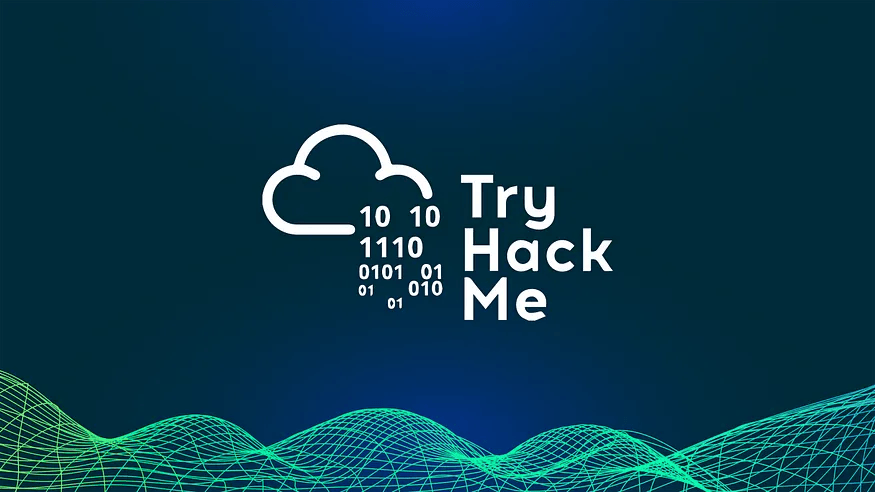

# 🔐 My TryHackMe Cybersecurity Roadmap (Documented Journey)

  

This repository documents my complete cybersecurity learning journey on TryHackMe — from absolute fundamentals to intermediate SOC skills.  
Every room includes notes, screenshots, summaries, and what I learned.  
The goal: build a public, transparent, and professional cybersecurity portfolio.

---

# 🎯 TryHackMe Paths Overview

---

## 🟣 Completed Path  
### ✔ **Pre-Security Path (TryHackMe)**  
This path built my foundations in:
- Introduction to Cybersecurity  
- Networking Basics  
- Linux Fundamentals  
- Windows Fundamentals  
- How the Web Works  

### 📜 Certificate  

  

---

## 🔵 Current Path  
### 🚀 **Cybersecurity 101 (In Progress)**  
This path builds deeper investigation skills, OSINT abilities, Windows/AD fundamentals, threat understanding, and hands-on cybersecurity reasoning.

### Completed So Far:
- **Start Your Cybersecurity Journey**  
  - Offensive Security Intro  
  - Defensive Security Intro  
  - Search Skills  
- **Linux Fundamentals** (previously completed under Pre-Security)  
- **Windows & AD Fundamentals**  
  - Windows Fundamentals 1, 2, 3 (linked from Pre-Security)  
  - Active Directory Basics (new, completed here)  
- **Command Line Fundamentals**  
  - Windows Command Line
  - Windows Powershell
  - Linux Shells
- **Networking**
  - Networking Concepts
  - Networking Essentials

More rooms will be added as I progress through Cybersecurity 101.

---

# 📚 Full Module Index

Below is the complete list of all modules for easy navigation:

---

### 🔐 Module 1 — Introduction to Cyber Security  
- [Offensive Security Intro](./Introduction-to-Cybersecurity/Offensive-Security-Intro.md)  
- [Defensive Security Intro](./Introduction-to-Cybersecurity/Defensive-Security-Intro.md)  
- [Careers in Cyber](./Introduction-to-Cybersecurity/Careers-in-Cyber.md)

---

### 🌐 Module 2 — Networking Fundamentals  
- [What is Networking](./Networking-Fundamentals/What-is-networking.md)  
- [Intro to LAN](./Networking-Fundamentals/Intro-to-LAN.md)  
- [OSI Model](./Networking-Fundamentals/OSI-model.md)  
- [Packets & Frames](./Networking-Fundamentals/Packets-and-Frames.md)  
- [Extending Your Network](./Networking-Fundamentals/Extending-your-network.md)

---

### 🐧 Module 3 — Linux Fundamentals  
- [Linux Fundamentals Part 1](./Linux-Fundamentals/Linux-Fundamentals-part-1.md)  
- [Linux Fundamentals Part 2](./Linux-Fundamentals/Linux-Fundamentals-part-2.md)  
- [Linux Fundamentals Part 3](./Linux-Fundamentals/Linux-Fundamentals-part-3.md)

---

### 🪟 Module 4 — Windows Fundamentals  
- [Windows Fundamentals Part 1](./Windows-Fundamentals/Part-1.md)  
- [Windows Fundamentals Part 2](./Windows-Fundamentals/Part-2.md)  
- [Windows Fundamentals Part 3](./Windows-Fundamentals/Part-3.md)

---

### 🌍 Module 5 — How the Web Works  
- [How Websites Work](./How-the-web-works/how-websites-work.md)  
- [HTTP in Detail](./How-the-web-works/HTTP-in-detail.md)  
- [DNS in Detail](./How-the-web-works/dns-in-detail.md)  
- [Putting It All Together](./How-the-web-works/Putting-it-all-together.md)

---

### 🧩 Cybersecurity 101 (Current Path)  

#### 📘 Module 1 — Start Your Cybersecurity Journey
- [Offensive Security Intro](./Introduction-to-Cybersecurity/Offensive-Security-Intro.md)  
- [Defensive Security Intro](./Introduction-to-Cybersecurity/Defensive-Security-Intro.md)  
- [Search Skills](./Cybersecurity-101/Start-Your-Cybersecurity-Journey/Search-Skills.md)

---

#### 🐧 Module 2 — Linux Fundamentals  
*(Completed under Pre-Security — linked here for path completeness)*  
- [Linux Fundamentals Part 1](./Linux-Fundamentals/Linux-Fundamentals-part-1.md)  
- [Linux Fundamentals Part 2](./Linux-Fundamentals/Linux-Fundamentals-part-2.md)  
- [Linux Fundamentals Part 3](./Linux-Fundamentals/Linux-Fundamentals-part-3.md)

---

#### 🪟 Module 3 — Windows & AD Fundamentals  
- [Windows Fundamentals Part 1](./Windows-Fundamentals/Part-1.md)  
- [Windows Fundamentals Part 2](./Windows-Fundamentals/Part-2.md)  
- [Windows Fundamentals Part 3](./Windows-Fundamentals/Part-3.md)  
- [Active Directory Basics](./Cybersecurity-101/Windows%20and%20Ad%20Fundamentals/Active-Directory-Basics.md)

---

#### 💻 Module 4 — Command Line Fundamentals  
- [Windows Command Line](./Cybersecurity-101/Command-Line/Windows-command-line.md)
- [Windows Powershell](./Cybersecurity-101/Command-Line/Windows-Powershell.md)
- [Linux shells](./Cybersecurity-101/Command-Line/Linux-shells.md)

---
#### 🌐 Module 5 — Networking  
- [Networking Concepts](./Cybersecurity-101/Networking/Networking-Concepts.md)
- [Networking Essentials](./Cybersecurity-101/Networking/Networking-Essentials.md)
- [Networking Core Protocols](./Cybersecurity-101/Networking/Networking-Core-Protocols.md)
- [Networking Secure Protocols](./Cybersecurity-101/Networking/Networking-Secure-Protocols.md)
- [Wireshark: The Basics](./Cybersecurity-101/Networking/Wireshark-The-Basics.md)
- [Tcpdump: The Basics](./Cybersecurity-101/Networking/Tcpdump-The-Basics.md)
- [Nmap: The Basics](./Cybersecurity-101/Networking/Nmap-The-Basics.md)

---
#### 🔐 Module 6 — Cryptography & Password Security  
- [Cryptography Basics](./Cybersecurity-101/Cryptography/Cryptography-Basics.md)
- [Public Key Cryptography Basics](./Cybersecurity-101/Cryptography/Public-Key-Cryptography-Basics.md)
- [Hashing Basics](./Cybersecurity-101/Cryptography/Hashing-Basics.md)
- [John the Ripper: The Basics](./Cybersecurity-101/Cryptography/John-The-Ripper-Basics.md)

---
#### 💣 Module 7 — Exploitation Basics  
- [Moniker Link (CVE-2024-21413)](./Cybersecurity-101/Exploitation-Basics/Moniker-Link-(CVE-2024-21413).md)
- [Metasploit Introduction](./Cybersecurity-101/Exploitation-Basics/Metasploit-Introduction.md)
- [Metasploit Exploitation](./Cybersecurity-101/Exploitation-Basics/Metasploit-Exploitation.md)
- [Metasploit Meterpreter](./Cybersecurity-101/Exploitation-Basics/Metasploit-Meterpreter.md)
- [Blue](./Cybersecurity-101/Exploitation-Basics/Blue.md)

---
#### 🌍 Module 8 — Web Hacking Fundamentals  
- [Web Application Basics](./Cybersecurity-101/Web-Hacking/Web-Application-Basics.md)
- [Javascript Essentials](./Cybersecurity-101/Web-Hacking/Javascript-Essentials.md)
- [SQL Fundamentals](./Cybersecurity-101/Web-Hacking/SQL-Fundamentals.md)
- [Burp Suite: The Basics](./Cybersecurity-101/Web-Hacking/Burp-Suite-The-Basics.md)

---
#### ⚔️ Module 9 — Offensive Security Tooling  
- [Hydra](./Cybersecurity-101/Offensive-Security-Tooling/Hydra.md)
- [Gobuster: The Basics](./Cybersecurity-101/Offensive-Security-Tooling/Gobuster-The-Basics.md)

---

# 🔧 How to Navigate This Repository
- Each folder contains a `README.md` with module notes.  
- Individual room writeups include:
  - What I learned  
  - Key takeaways  
  - Screenshots  
  - Practical notes  
- All images are stored in:  
  `./assets/images/`  
- Use the module index above to explore any topic.

---

# 🚀 Upcoming Work
- Continue **Cybersecurity 101 Path**  
- Complete Windows Security + Enterprise security rooms  
- Begin Investigations + Incident Response basics  
- Build deeper skills toward SOC Analyst Level 1  
